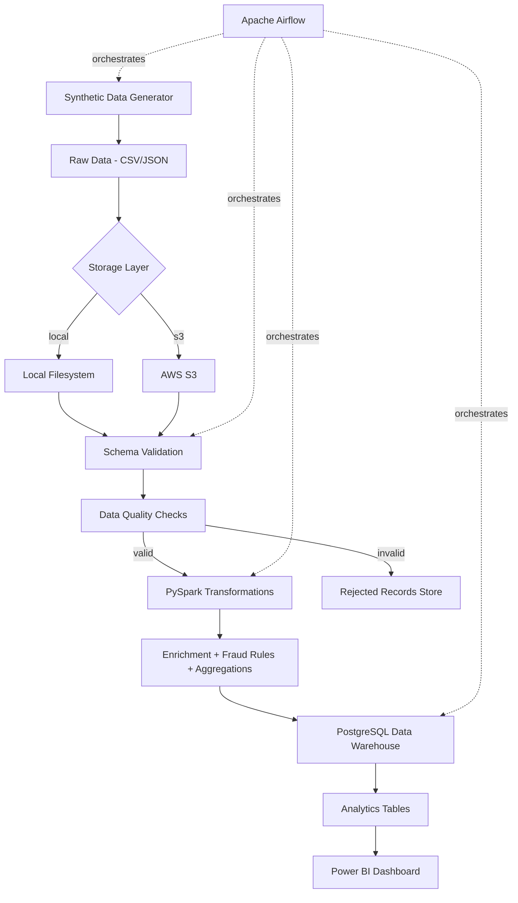
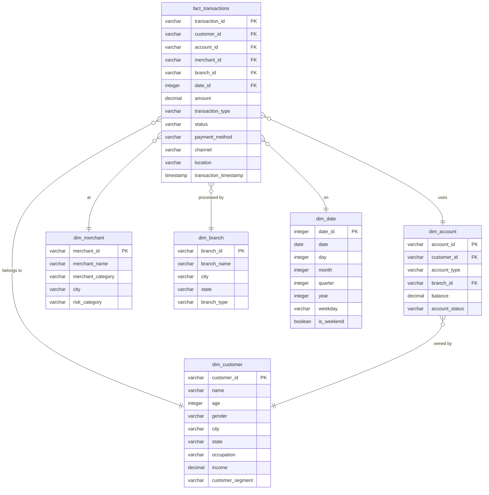

# Banking Data Engineering Platform — Architecture

## Overview

This document describes the technical architecture of the platform in detail.

---

## System Design Principles

| Principle | Implementation |
|-----------|---------------|
| **Separation of Concerns** | Each module has one responsibility (generate, validate, transform, load) |
| **Idempotency** | Running the same pipeline twice produces the same result |
| **Incremental Processing** | Only new records are processed on each run |
| **Observability** | Every pipeline run is logged and stored in `quality.pipeline_runs` |
| **Testability** | All modules are independently testable |
| **Portability** | Runs locally (Docker) or on cloud (AWS) without code changes |

---

## Data Flow



---

## Data Lake Layers

### Why a Data Lake?

A data lake stores data in its **native format** before transformation.
This is important because:
- Raw data is preserved for debugging and re-processing
- Schema changes can be handled without data loss
- Multiple consumers can process the same raw data differently

### Layer Structure

```
data/
├── raw/           ← Original data, never modified
│   ├── customers/
│   ├── accounts/
│   ├── transactions/  (partitioned by date in production)
│   ├── merchants/
│   └── branches/
│
├── processed/     ← Spark-cleaned data in Parquet
│   ├── customers/
│   ├── accounts/
│   └── transactions/
│
├── curated/       ← Dimensional data ready for warehouse
│   ├── fact_transactions/
│   ├── dim_customer/
│   ├── dim_account/
│   ├── dim_merchant/
│   ├── dim_branch/
│   └── dim_date/
│
└── rejected/      ← Failed quality checks (never silently deleted)
    ├── customers/
    ├── accounts/
    └── transactions/
```

### Why Partitioning?

In production, transactions are partitioned by date:
```
transactions/year=2024/month=08/day=12/part-0000.parquet
```

**Why this matters:**
- A query for "August 12 transactions" reads **only** August 12 partitions
- Without partitioning, the query scans ALL transaction files
- At 5M records/day, partitioning reduces read I/O by 99%+
- Spark and AWS Athena both support partition pruning automatically

---

## Star Schema Design



### Why Star Schema?

| Benefit | Explanation |
|---------|-------------|
| **Query Performance** | Joins are simple (fact → dimension), no complex multi-joins |
| **BI Tool Compatible** | Power BI, Tableau work natively with star schemas |
| **Denormalized** | Dimension attributes stored on dimension, not fact — reduces joins |
| **Aggregation Friendly** | `GROUP BY dim_customer.segment` is a single join + group |

---

## Incremental Processing Strategy

### Problem

At 5M transactions/day, re-processing the entire history on each run is wasteful.

### Solution: Watermark-Based Incremental

```
Day 1 Run:
  → Process ALL records
  → Store watermark: last_processed = "2024-01-31 23:59:59"

Day 2 Run:
  → Read watermark: "2024-01-31 23:59:59"
  → SELECT * FROM raw WHERE ingestion_timestamp > watermark
  → Process only NEW records (e.g., 150,000)
  → Update watermark: last_processed = "2024-02-01 23:59:59"
```

### Late-Arriving Data

Records arriving late (e.g., offline UPI transactions syncing 2 days later)
are handled by a `late_arriving_days` buffer:

```
effective_watermark = stored_watermark - late_arriving_days
```

This re-processes the last N days to catch late records.
The idempotency guarantee (upsert/MERGE) ensures no duplicates.
